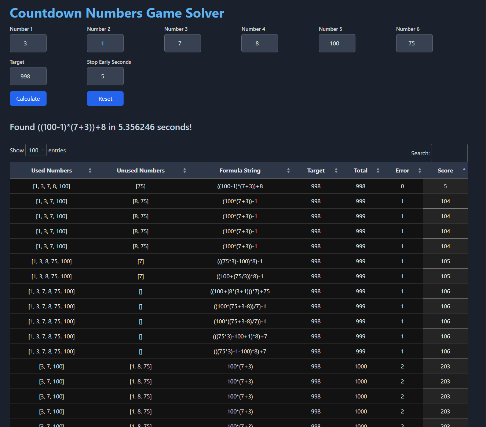

# Countdown Numbers Game Solver

This is a simple Flask wrapper for a solver for the numbers part of the [Countdown game show](https://en.wikipedia.org/wiki/Countdown_(game_show)). The motivation behind this project was curiosity.

## Features

- Solve the numbers round of Countdown with ease.
- Flask-based web interface for easy interaction.

## Requirements

- Python 3.12 or later
- Dependencies listed in `requirements.txt`

## Installation

1. Clone the repository:

    ```sh
    git clone https://github.com/AlexanderHS/countdown_maths_solver.git
    cd countdown_maths_solver
    ```

2. Create and activate a virtual environment (optional but recommended):

    ```sh
    python -m venv venv
    source venv/bin/activate  # On Windows, use `venv\Scripts\activate`
    ```

3. Install the required dependencies:

    ```sh
    pip install -r requirements.txt
    ```

## Usage

1. Run the Flask application:

    ```sh
    python app.py
    ```

2. Open your web browser and go to `http://127.0.0.1:8045` to access the application.

3. Enter the numbers and target value as prompted to get solutions for the Countdown numbers game.

## License

This project is licensed under the MIT License. See the [LICENSE](LICENSE) file for details.

## Contact

For any questions or support, please contact Alex Hamilton-Smith at alexhamiltonsmith [at] pm.me.

## Acknowledgments

- The [Countdown game show](https://en.wikipedia.org/wiki/Countdown_(game_show)) for the inspiration.
- Flask for the web framework.

## Screenshots



